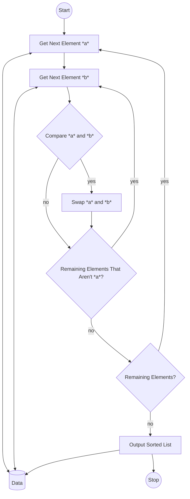

* Ignore for ToC
{:toc}

As a quick advisory, this post talks about my approaches to organizing information, as a sneaky way to introduce readers---especially those of you who don't write software---to simple technologies that will allow you to make the most of developer tools, no matter what you actually do with your time.  I'll follow up this post on an irregular basis, introducing those tools and why you might want to care about them.


If it feels more like a Sunday rant, well...I originally wrote the post with that in mind, but since I already published it elsewhere---meaning that I wanted to get to it soon---and news of a certain billionaire taking control of a certain social network that I use taking the logical place of this Sunday's slot, this goes on a Wednesday, since we haven't had a [tech tip](/blog/tag/techtips) in a while.

## OK, but Can We Start the Post...?

Recently looking through my various note files---notes that span stories, business ideas, project designs, blog posts, some source material, lecture notes from when I used to teach, and so forth---and noticed that about twenty-five years of these notes include more than *ten million words* 🎉 🤮.  That doesn't count notes that I wrote for jobs, since I've never kept any copies of that.  In other words, it's hard to shut me up.

Maybe of interest to some readers is that I maintain the notes (and everything else that I can) in text-based formats, when possible, a lesson that took too long for me to learn.

## A Quick Story

At one of my first jobs, we started discussing the possibility of replacing large parts of the code to shift the users away from [VT320](https://en.wikipedia.org/wiki/VT320) terminals and into...y'know, something more like a windowed application on a graphical operating system, like the rest of the world did.  I forget why we didn't just direct them to VT320 emulators, which was my initial recommendation to buy time while we worked on a more robust solution.  That's not important for the story, though.

As we started estimating the scope of this project, I asked the obvious question:  Where were the original specifications for the system?  Specifically, how would we know that the new version provided what the original promised.

My boss sent someone off to the archives, coming back with a dusty, bent 5¼" floppy disk.  The file system on the disk was some Apple format that we all considered archaic even then, and once we found a way to extract the data from the disk, found an indecipherable binary file.

Making matters worse, nobody could remember what application they used to write the documentation almost twenty years prior.  The documentation, then, was completely inaccessible, leaving us without viable documentation beyond our own knowledge of the software.

## A Longer Story

As I mentioned above, I taught---college graduate courses---for about fifteen years.  Because my first class split the students between two facilities with a video link, I settled on a process of  producing a complete set of notes to refer to when I would inevitably lose track of where I was in the lecture, a sparser outline to distribute to help students keep track of where we should be, and a presentation to show on one screen that mostly followed the outline.

I initially wrote these in whatever version of [WordPerfect](https://en.wikipedia.org/wiki/WordPerfect) that I had at the time, which most of the school also used.

Eventually, WordPerfect fell out of favor.  The school no longer had copies, so I started importing the WordPerfect files into [Microsoft Word](https://en.wikipedia.org/wiki/Microsoft_word) every week.  That worked, but the conversions had enough flaws that I needed to manually review every lecture to fix the layout.  Not wanting to go through that every year, I quickly just converted all the files to Word's (old) format.

A couple of years later, I moved to [OpenOffice.org](https://en.wikipedia.org/wiki/OpenOffice.org) at home.  Learning my lesson about the tedious imports, I installed the software on the computer at my office at school, and converted everything for the second time, this time learning to use features like styles.

The school's IT department decided to ban user-installed software on the office computers, meaning that I needed to import everything back into Microsoft Word.  Word and the OpenOffice family didn't understand each other's styles, making this tedious, and meaning that I needed to convert everything back to Microsoft Word's format.

I'm probably missing a couple of transitions, but you get my point.  But then, I started moving my home computers to Linux, which caused new problems...

## Text Is King...or at Least in the Royal Family

My solution for my lecture notes---not as useful as I would have liked, since the school closed a couple of years later, but still worth the effort---was to convert them to [Markdown](https://en.wikipedia.org/wiki/Markdown), adding a macro package to generate multiple versions of each document from the single source.  Rather than waste time at the last minute with any word processor, I generated PDF files, ready to print.

Since then, I have used text-adjacent formats for everything new, and slowly converted anything that I need to hunt for, if it turns up in a different format.

Here's a quick tour of why I prefer formats designed around (mostly) just having text to read.

### Importing

The most useful aspect of plain text revolves around how it stores and compresses well, when that’s important.  Because we know how to store text, other applications can manage revisions of notes like code---I highly recommend putting notes in version control, by the way, so that you never lose anything, even when you delete it---compress into archives, or add to some application's database when that application provides some useful functionality.

Similarly, I can encrypt the files to keep other people out of my notes, even if they gain access.

#### Externalization

I should mention that, back through when I went to college, a huge field of research involved how to develop and adapt programming languages to "externalize" data.  That is, we had a movement of people hoping to update language run-times, so that a program in a given language could save data in a format that other programs could read, regardless of the language used to write it or the hardware used to read it.

Most people considered it a lost cause, until JavaScript produced something text-based, and asked us to ignore the data types.

### Visibility

No matter what computer that I happen to use at a given time, I can access my notes.  It’s possible to quickly read, search, and edit whatever I’m working on with standard tools, and I can even scale down the memory and CPU footprint if the machine becomes overloaded.

I have referenced my notes from Windows PCs and Linux PCs, including from the console on a [Pocket C.H.I.P.](https://shop.pocketchip.co/) from an impromptu meeting.

Analyzing text is also easy.  As I get older, I care less about manually making sure that my writing, whatever its logical faults might be, is readable to people who aren't me.  I still want it to *happen*, of course.  However, I don't want to put in the work, when I can use that energy for something more interesting.  And so, any writing meant to leave my desk gets a check from [LanguageTool](https://languagetool.org/), [proselint](http://proselint.com/), [write-good](https://github.com/btford/write-good), and [alex](https://alexjs.com/) to warn me when I'm about to make a huge mistake, just like when I publish source code...which you'll notice is *also* still always text.

I could also perform sentiment analysis, check for overused words, estimate reading difficulty, or push it through an API to provide a rough translation into another language.

### Application-Independence

I’m not tied to specific applications.  If I ever teach again, I won't need to convert my lecture notes to Google Docs or the modern LibreOffice format.  If an online service goes out of business or someone hacks their servers, I won't lose access to my notes.

Likewise, if someone had the foresight on that aforementioned job to write the specification as text---or export to text---and include it in the version control repository, updating the interface *probably* wouldn't have taken so long that the software lost its remaining customers, leading to disbanding that department.

More to the point, I *can* and often do use a fancy editor with dozens of plugins, but I can also use the default text editor on any machine, and that will turn out fine, too.

### Conversions

It’s easier to convert text to another format, making it closer to future-proof.

For example, [this blog](/blog) currently runs on [Jekyll](https://jekyllrb.com/).  It works, but as I mentioned in an early [post about choosing the blog's software](), it's not a "fun" solution.  Part of me would rather publish with [Gatsby](https://www.gatsbyjs.com/) or something similarly new.  I probably won't, but I *can*, because I merely need to rewrite the "front matter" on my posts to make them usable for another static site generator.  Or---as mentioned---I can import them into a database, if I decide to use something other than a static site generator.

Similarly, while I haven't done so, I could write a script to convert my old lecture notes into a desktop publishing format, essentially turning them into basic textbooks...if that was something that I wanted to do.

### Content First

This feels like a more subtle issue today, but working in text limits the opportunity to procrastinate.

For example, I watched two offices upgrade computers to Windows.  In both cases, management slowed to a crawl and secretaries saw an increased workload.  Why?  The managers let themselves get pulled down the rabbit-hole of formatting options, wasting valuable time on fonts and line-spacing options...which the secretaries needed to reverse anyway, to maintain a consistent "brand" from the office.

Working in text leaves the presentation to the end of writing, where it probably belongs, for most people.

## The Grass Is Always Greener...

That all said, text-based formats aren't perfect for everything.  Every choice involves a trade-off.  Here are some quick examples of the issues.  Note that, when I contrast two values, I mean to say that it's the *primary* tension in my experience, not that these are independent qualities along orthogonal axes.

**Readability comes at the expense of semantic meaning**.  Markdown lacks the conceptual framework for a threaded conversation or a pull-quote.  Comma-separated values (CSV files) can't solve mathematical problems based on the data.  Those CSV files also can't refer to each other.  Users need to add those with additional code, usually split between the documents and the supporting applications.

**Independence comes at the expense of organization**.  While I don't worry about my work locked to a specific vendor, I *do* worry that I have my work scattered across at least half a dozen active repositories, sometimes starting an idea in one, then picking it up ten years later in another repository.  I mitigated that problem by writing a simple search engine, but that's an ugly solution that not everybody has the time and knowledge to create.

**Flexibility to import and export comes at the expense of uniqueness**.  Every time that I update a key document, I need to confirm that it looks right in all destination formats.  If I choose to allow a service to import some documents to use a fancy feature, I need to make sure to propagate changes to both versions.

**Simplicity comes at the expense of custom formatting**.  Usually, formatting doesn't matter.  This post just needs to look like everything around it, for example, and it would be *bad* if it had a different look.  Notes usually just need to get the point across.  However, for a résumé, you probably want to tweak some spacing here and there, to draw attention to key details or keep from wasting an extra page.  A textbook might need multiple kinds of text with unrelated styles.  A children's book or art book might have its own visual language that needs to periodically change.

**Longevity comes at the expense of convenience**.  With my notes, I'm responsible for securing them, making them available to people when the need arises, converting them to formats that offices understand, and other management tasks.  My blog includes about a dozen plugins to extend Markdown into something with slightly more semantic meaning; my lecture notes have similar extensions processed by code.  Linking one note to another requires some invented standard that my software knows how to navigate.  That all requires custom code.

In other words, "we need to convert everything to plain text, because some nobody on the Internet does that" shouldn't guide your day.

## Useful Formats

If the trade-offs sound reasonable to you, though, then you might wonder what formats feel the most standard for a particular purpose.  Here's a quick tour of the best that I've been able to find.

### JSON, for General Data

As mentioned above, once the JavaScript people started using JSON, it spread quickly.  Now, it's hard to find a system that *doesn't* have a library to export data to JSON and import it back to native data.

Naturally, JSON doesn't solve *all* data problems.  The data types---number, string, boolean, array, object, and null---reflect JavaScript's architecture, rather than some general specification, for example.  Many see it overly verbose for the information that it carries.  And the format has a certain fragility that doesn't need to be there.

Likewise, I *recommend* JSON, but other formats exist that might fit an application better, such as the [PHP serialization format](https://en.wikipedia.org/wiki/PHP_serialization_format) or [YAML](https://en.wikipedia.org/wiki/YAML).  Just be sure that it has wide support.  I *like* [ASN.1](https://en.wikipedia.org/wiki/ASN.1) and [Open DDL](https://en.wikipedia.org/wiki/Open_Data_Description_Language), for example, but not everybody has libraries that supports them, and I don't have the patience to write them, which (in my opinion) makes them useless.

### Markdown, for Text

Names that you probably know in other contexts---John Gruber and Aaron Swartz---created [Markdown](https://en.wikipedia.org/wiki/Markdown) with readability in mind, and it has become standard enough that organizations like GitHub and GitLab simply assume that you'll write in Markdown.  Implementations have diverged---adding features---and converged back, so you can generally rely on everything from headings to tables.

You probably already know how to write Markdown, because many web-based communities, even the comments below 👀, use it as their standard for writing messages.

If you look, you can find two sub-categories of Markdown, depending on the use.

*Markdown-based Formats* abound for projects made up *mostly* of text, but not entirely.  For example, [Markdown Presentations](https://github.com/k-k/markdown-presentation) generates...well, presentations from Markdown.  [R Markdown](https://rmarkdown.rstudio.com/) facilitates organizing "notebooks" of code in various languages with descriptive text.  [Fountain](https://fountain.io/) uses Markdown as the basis for working with screenplays.

*Embedded Markdown* appears in applications that support the easy editing of Markdown, but want to add metadata for organization or other management.  The aforementioned Boost Note, for example, stores Markdown text---the note---as an element of a [CSON](https://github.com/bevry/cson) object that describes how software should categorize and display the note.  Similarly, the blog formats using Markdown *technically* embed that Markdown in custom text-based formats that append the Markdown content---the actual blog post---to a text-based format of metadata, including the title and publication date.

You can also find *many* alternatives to Markdown, and they're fine, too, if they do what you want.  I would recommend Markdown, however, because many applications and software libraries support it.  But if you'd rather work in Perl's old [pod](https://en.wikipedia.org/wiki/Plain_Old_Documentation) format or something else less popular, I won't judge you...well, not much, at least.

### CSV, for Spreadsheets

If you have lists, simple tables, and ledgers, then you probably want that information stored as [comma-separated values](https://en.wikipedia.org/wiki/Comma-separated_values).  It's easy to type and edit the data, and it's easy to convert it to something else, like a Markdown table, SQL `INSERT` statements, or any other way that you might want to process the data later.

Yes, this is a boring enough solution that every spreadsheet application already knows how to process it.

If the commas make your data seem claustrophobic, you could also use [TSV](https://en.wikipedia.org/wiki/Tab-separated_values) files, which change the delimiter.

### Mermaid, for Diagrams

You should probably learn [Mermaid](https://mermaid-js.github.io/mermaid/).  It's good stuff, if you need diagrams.  Here's an example, a flowchart based on a simple sorting algorithm.



Other ways to organize that exist---we could integrate the labels with the linkages, and combine some links---but this works for a readable example.  We have nodes with IDs, optional different shapes, optional text that defaults to the ID, and links between the nodes.  Then, Mermaid generates an image, possibly with special styling.  Let's look at a default layout.


If you don't care about flowcharts, you'll still eventually need a class diagram, a Gantt chart, a version control "subway map," or even a pie chart.  Mermaid handles those and more.  Also, I should mention that a "flowchart" doesn't need to represent a program; I've used the same syntax to visualize exchanges or other relationships.

#### Less Ambitious than Mermaid?  Pic.

Mermaid covers just about any kind of diagram that you might need, but if your needs are simpler and you prefer standard tools, [pic](http://floppsie.comp.glam.ac.uk/Glamorgan/gaius/web/pic.html) might be more your style.  The language dates to the 1980s, created by UNIX co-creator Brian Kernighan, and has a converter packaged with or accessible from every UNIX and Linux distribution, and easily built for Windows.

### Recutils, for Databases

You have probably at least *heard* of the other formats, but [recutils](https://labs.tomasino.org/gnu-recutils/) may still be new to you.  I only [discovered recutils in 2020]()---you can read a more thorough description of the format in that post---and I searched for this sort of thing regularly.

For those who haven't had the pleasure, recutils provides a system to manage plain-text databases.  If a CSV file is too simple for your data storage needs, recutils provides you with the ability to define an optional schema, as well as tools (command-line and an occasional library) to query and modify the data in a way that approximates SQL, if you squint your eyes and cock your head to one side.

Here's part of a simple example, from the blog post that I referenced earlier.

```recfile
%rec: website
%doc: Favorite websites submitted to the database.

%type: id int
%type: url line
%type: owner rec user
%type: created_at: date
%type: updated_at: date

%key: id
%mandatory: url owner
%allowed: description

%auto: id created_at updated_at

id: 1681
description:  Wikipedia is an online free-content encyclopedia
+ helping to create a world where everyone can freely share and
+ access all available knowledge. It is supported by the
+ Wikimedia Foundation and consists of freely editable content.
+ The name "Wikipedia" is a blending of the words wiki (a
+ technology for creating collaborative websites, from the
+ Hawaiian word wiki, meaning "quick") and encyclopedia.
+ Wikipedia's articles provide links to guide readers to
+ related pages with more information. 
owner: 7760
url: https://en.wikipedia.org/wiki/Main_Page
```

Everything but the last few lines is schema and typing information, and the final seven lines (plus the timestamps that I skipped) make an example record.  Most people, if they're asking why this wouldn't just be a CSV file, want to take note of the `%type: owner rec user` line.  That says that the `owner` field refers to---is a *foreign key* to, if you're a database person---the user table, which I didn't bother to show, because that could be another file, and this is probably already more than anybody cares to read.  That foreign key allows the recutils tools to automatically join the tables as necessary.

Also, any `%allowed` field without a `%type` represents strings that can stretch across multiple lines, with additional lines prefaced by a plus-sign.

Better, you can also *start* with CSV files, and grow into this scheme.  If you install recutils, you get a nice little tool named `csv2rec`, which does the obvious thing.

The big caveat?  Not many platforms have recutils support.  The team maintains a C library, but if you want to access it from another language, you have work to do.

### Alda for Music

This is far from a perfect solution, because only one implementation seems to exist at the moment, and it's not what I'd call "user-friendly."  But for those of us who have an occasional musical idea but no musical training, [Alda](https://alda.io/) seems like the best bet.  Even if a better format shows up, though, this gives a nice idea of the value of plain-text formats.  For an example, this plays *Twinkle, Twinkle, Little Star*.

```alda
guitar:
  o2
  d4 d a a b b a2
  g4 g f+ f+ e e d2
  a4 a g g f+ f+ e2
  a4 a g g f+ f+ e2
  d4 d a a b b a2
  g4 g f+ f+ e e d2

midi-woodblock:
  r d r a r b r a
  r g r f+ r e r d
  r a r g r f+ r e
  r a r g r f+ r e
  r d r a r b r a
  r g r f+ r e r d
```

I didn't need to learn music notation, just a general idea of the melody---the guitar part---and relationships between notes.  I know the note names and lengths, making that easy.  Listening, I added a sharp (`+` in Alda) to the notes that sounded flat.  Then, I added the laziest possible percussion to support it, alternating notes with musical rests.

If I had a better ear for music, I could have bolstered the important notes of the melody with chords.  Someone who understood counterpoint could also easily add another instrument.  A melody with a broader range can jump up (`>`) or down (`<`) an octave.

We could also make this more extreme, having software *generate* a melody, then tweaking the notes manually as the composer listens to it.

Regardless, for now, Alda can export a MIDI file, which other software (and musicians) can process further.

#### More Sophisticated?  CSound.

A much older system, [CSound](https://csound.com/) expects you to understand sound synthesis---a CSound program includes everything from the shapes of the generated waves to the frequencies played---but that detail allows a developer to produce almost any sound that they might want.

Rather than "playing a tune," CSound expects you to design and program synthesizers...which is good, *if* you need that flexibility.

## Maybe More...

For clarity, I'm just a single person.  This is a peek into how I work, not an exhaustive description of the strange borderlands between software development and the rest of the world.

Therefore, let's open the discussion up.  Other than source code and configuration files, what text-based formats have I overlooked?  What features sit in non-text data formats that would be difficult to represent readably as text?

* * *

**Credits**:  The header image is [untitled](https://pxhere.com/en/photo/672822) by an uncredited PxHere photographer, made available under the terms of the [Creative Commons CC0 1.0 Universal Public Domain Dedication](https://creativecommons.org/publicdomain/zero/1.0/).
